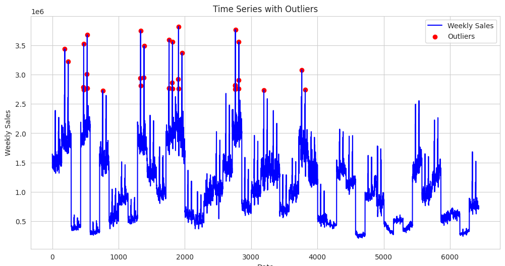

# 🛒 Walmart Sales Forecasting & Inventory Optimization

**Time series forecasting project for Walmart's 45 stores to predict weekly sales using SARIMA. Analyzed trends, holidays, and external factors to improve inventory planning, reduce stock issues, and enhance customer satisfaction with 12-week forecasts.**

---

## 📁 Project Structure

```
Walmart-Sales-Forecast/
├── data/
├── notebooks/
├── models/
├── outputs/
│   ├── forecasts/
│   └── plots/
├── src/
├── docs/
│   └── Walmart_Sales_Forecast_Report.pdf
├── README.md
├── requirements.txt
└── LICENSE
```

---

## 🧠 Problem Statement

Walmart stores across the U.S. face challenges in matching inventory with weekly demand. Over- or under-stocking leads to customer dissatisfaction and increased holding costs. This project uses historical sales data to build accurate forecasting models for smarter inventory decisions.

---

## 🎯 Objectives

- Forecast weekly sales at the store level for 12 weeks
- Understand sales drivers like holidays, CPI, unemployment, and temperature
- Identify top-performing vs underperforming stores
- Improve stock replenishment and customer satisfaction

---

## 📊 Exploratory Data Analysis

### 🔍 Weekly Sales with Outliers

Outliers were detected during seasonal peaks like holidays.



---

### 📈 Feature Correlation Heatmap

Unemployment and CPI had mild effects. Holidays had a more direct influence on sales.


---

## 🛠️ Modeling Approach

Time Series Forecasting was performed using the **SARIMA** model:

- Seasonal decomposition
- Differencing to ensure stationarity
- ACF/PACF analysis for hyperparameter tuning
- Evaluation using RMSE and MAE

---

## 📉 Model Performance

### 🧪 Actual vs Predicted (Validation)

A close match between actual and predicted values confirms robust model performance.


---

### 🔮 Forecasting: Next 12 Weeks

The SARIMA model was used to forecast future sales trends for each store.


---

### 🏪 Forecast Comparison: Top 5 Stores

Each store has unique seasonal patterns and sales magnitudes.


---

### 🌐 Multi-Store Seasonality Comparison

All 45 stores show distinct trends, highlighting the need for store-specific models.


---

## 📌 Key Insights

- 📆 **Holidays** have a significant positive impact on sales.
- 🌡️ **Temperature** has limited but variable store-wise influence.
- 📉 **Unemployment** correlates negatively with sales.
- 🏆 Store 20 shows highest consistent performance.
- 📉 Store 33 is underperforming and requires business intervention.

---

## 🚀 Future Work

- Add external sources: Weather APIs, Economic indices
- Try machine learning models like LSTM or XGBoost
- Enable real-time forecasting pipelines
- Optimize product-level inventory

---

## 📄 Full Report

📥 [Download PDF Report](docs/Walmart_Sales_Forecast_Report.pdf)

---

## ⚙️ Requirements

```txt
pandas
numpy
matplotlib
seaborn
statsmodels
pmdarima
scikit-learn
openpyxl
```

---

## 👨‍💻 Author

Capstone Project – Data Science & AI Certification  
GitHub: [Brightson-Abraham](https://github.com/Brightson-Abraham)
